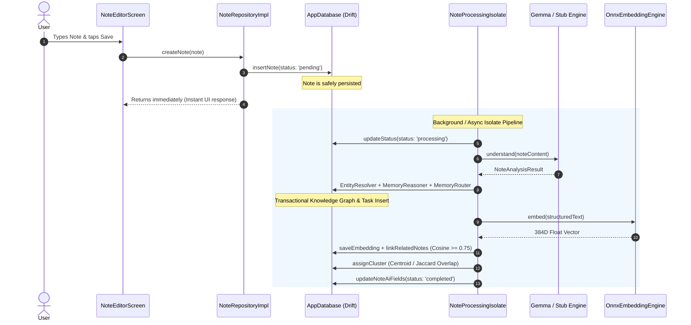
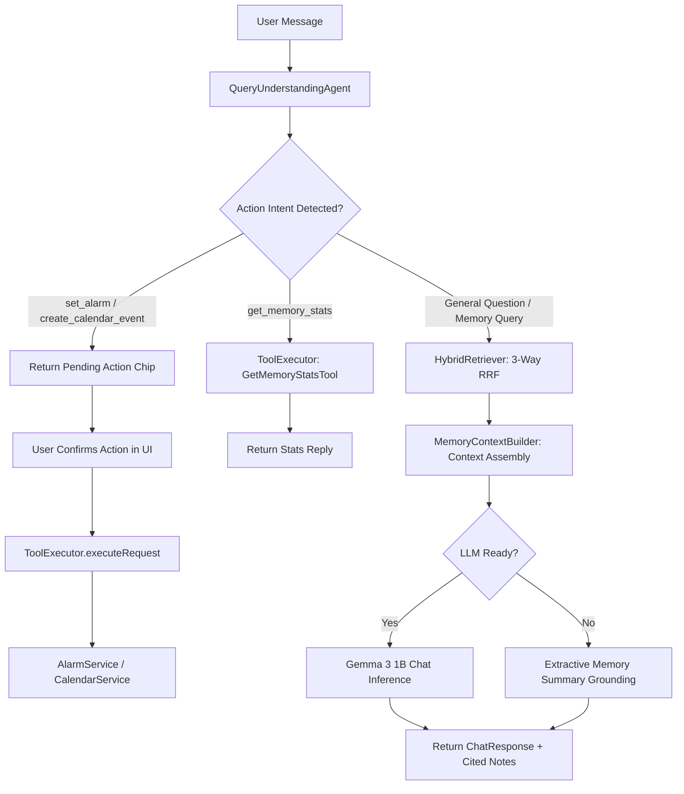

# NENAI V3 Architecture Baseline & System Audit

> **Document Version:** 3.0-BASELINE  
> **Status:** Approved Baseline  
> **Date:** August 2026  
> **Repository:** `nenAI` (Flutter / Dart)  
> **Baseline Verification:** `flutter analyze` (0 issues) | `flutter test` (9/9 passed)

---

## Executive Summary

This document establishes the authoritative technical baseline of the **NENAI** codebase prior to implementing V3 enhancements. It documents every system layer, data contract, AI agent, processing pipeline, and UI flow.

Subsequent architectural phases must preserve all functional contracts defined herein, ensuring zero regression of working capabilities:
- On-device local intelligence (Gemma 3 1B LiteRT + all-MiniLM-L6-v2 ONNX 384D)
- Multi-agent memory formation (Understanding -> Entity Resolution -> Reasoner -> Router -> Linker)
- 3-Way Reciprocal Rank Fusion retrieval (Full-Text Search + Dense Vector Search + Knowledge Graph)
- MCP-compliant tool execution pipeline with pre-action confirmations
- Offline SQLite storage with Drift and reactive Riverpod state management

---

## 1. Current Database Schema

NENAI uses [Drift](file:///c:/project1/nenAI/lib/data/local/database/app_database.dart) (`drift: ^2.14.0`, `drift_flutter: ^0.1.0`) targeting a local SQLite database (`nenai.db`, schema version `3`).

### 1.1 Tables Summary

| Table Name | File Link | Primary Key | Description |
|---|---|---|---|
| `notes` | [notes_table.dart](file:///c:/project1/nenAI/lib/data/local/database/tables/notes_table.dart) | `id` (TEXT) | Core note entries, AI summaries, keywords, cluster pointers, and processing status. |
| `embeddings` | [embeddings_table.dart](file:///c:/project1/nenAI/lib/data/local/database/tables/embeddings_table.dart) | `noteId` (TEXT FK) | 384-dimensional dense float vector embeddings stored as 1536-byte raw BLOBs (IEEE 754 LE). |
| `clusters` | [clusters_table.dart](file:///c:/project1/nenAI/lib/data/local/database/tables/clusters_table.dart) | `id` (TEXT) | Topic clusters with user-editable names and hex colors. |
| `chat_messages` | [chat_messages_table.dart](file:///c:/project1/nenAI/lib/data/local/database/tables/chat_messages_table.dart) | `id` (TEXT) | Persistent multi-session chat conversation messages, cited notes, and pending tool actions. |
| `entities` | [entities_table.dart](file:///c:/project1/nenAI/lib/data/local/database/tables/entities_table.dart) | `id` (TEXT) | Resolved Knowledge Graph entities (person, project, technology, concept, etc.) and canonical names. |
| `relationships` | [relationships_table.dart](file:///c:/project1/nenAI/lib/data/local/database/tables/relationships_table.dart) | `id` (TEXT) | Knowledge Graph triples (`sourceEntityId` --`relation`--> `targetEntityId`) with source memory links. |
| `tasks` | [tasks_table.dart](file:///c:/project1/nenAI/lib/data/local/database/tables/tasks_table.dart) | `id` (TEXT) | Actionable tasks extracted from notes with parsed epoch due timestamps. |
| `memory_entities` | [memory_entities_table.dart](file:///c:/project1/nenAI/lib/data/local/database/tables/memory_entities_table.dart) | `(memoryId, entityId)` | Many-to-many join table between notes/memories and referenced entities. |

### 1.2 Table Column Details

```sql
-- notes table
CREATE TABLE notes (
  id TEXT NOT NULL PRIMARY KEY,
  content TEXT NOT NULL,
  summary TEXT,
  keywords_json TEXT NOT NULL DEFAULT '[]',
  cluster_id TEXT,
  related_note_ids_json TEXT NOT NULL DEFAULT '[]',
  processing_status TEXT NOT NULL DEFAULT 'pending',
  created_at INTEGER NOT NULL,
  updated_at INTEGER NOT NULL
);

-- embeddings table (Cascade Delete with Notes)
CREATE TABLE embeddings (
  note_id TEXT NOT NULL PRIMARY KEY REFERENCES notes(id) ON DELETE CASCADE,
  vector BLOB NOT NULL
);

-- clusters table
CREATE TABLE clusters (
  id TEXT NOT NULL PRIMARY KEY,
  name TEXT NOT NULL,
  color_hex TEXT NOT NULL,
  created_at INTEGER NOT NULL
);

-- chat_messages table
CREATE TABLE chat_messages (
  id TEXT NOT NULL PRIMARY KEY,
  text_content TEXT NOT NULL,
  is_user BOOLEAN NOT NULL,
  timestamp INTEGER NOT NULL,
  cited_notes_json TEXT NOT NULL DEFAULT '[]',
  pending_action_json TEXT,
  action_executed_message TEXT
);

-- entities table
CREATE TABLE entities (
  id TEXT NOT NULL PRIMARY KEY,
  name TEXT NOT NULL,
  type TEXT NOT NULL,
  canonical_name TEXT NOT NULL,
  aliases_json TEXT NOT NULL DEFAULT '[]',
  created_at INTEGER NOT NULL,
  updated_at INTEGER NOT NULL
);

-- relationships table
CREATE TABLE relationships (
  id TEXT NOT NULL PRIMARY KEY,
  source_entity_id TEXT NOT NULL,
  relation TEXT NOT NULL,
  target_entity_id TEXT NOT NULL,
  source_memory_id TEXT NOT NULL,
  confidence REAL NOT NULL DEFAULT 1.0,
  created_at INTEGER NOT NULL,
  updated_at INTEGER NOT NULL
);

-- tasks table
CREATE TABLE tasks (
  id TEXT NOT NULL PRIMARY KEY,
  memory_id TEXT NOT NULL,
  description TEXT NOT NULL,
  due_date TEXT,
  due_timestamp INTEGER,
  is_completed BOOLEAN NOT NULL DEFAULT 0,
  created_at INTEGER NOT NULL,
  updated_at INTEGER NOT NULL
);

-- memory_entities join table
CREATE TABLE memory_entities (
  memory_id TEXT NOT NULL,
  entity_id TEXT NOT NULL,
  role TEXT NOT NULL DEFAULT 'mentioned',
  PRIMARY KEY (memory_id, entity_id)
);
```

### 1.3 Data Access Objects (DAOs)

- [NotesDao](file:///c:/project1/nenAI/lib/data/local/database/daos/notes_dao.dart): Reactive streams (`watchAll`, `watchByCluster`), one-shot queries (`getById`, `getByIds`, `search`, `getPending`), and write operations (`insertNote`, `updateNote`, `updateAiFields`, `updateStatus`, `deleteNote`).
- [EmbeddingsDao](file:///c:/project1/nenAI/lib/data/local/database/daos/embeddings_dao.dart): `getByNoteId`, `getAll`, `upsert`, `deleteByNoteId`.
- [ClustersDao](file:///c:/project1/nenAI/lib/data/local/database/daos/clusters_dao.dart): `watchAll`, `getById`, `upsert`, `rename`, `deleteById`.
- [ChatMessagesDao](file:///c:/project1/nenAI/lib/data/local/database/daos/chat_messages_dao.dart): `watchAllMessages`, `getAllMessages`, `insertMessage`, `updateMessage`, `clearAll`.
- [EntitiesDao](file:///c:/project1/nenAI/lib/data/local/database/daos/entities_dao.dart): `watchAll`, `getAll`, `getById`, `getByCanonicalName`, `getByType`, `searchByName`, `getEntitiesForMemory`, `upsertEntity`, `linkEntityToMemory`, `deleteEntity`.
- [RelationshipsDao](file:///c:/project1/nenAI/lib/data/local/database/daos/relationships_dao.dart): `watchAll`, `getAll`, `findExactRelationship`, `getByEntityId`, `getByMemoryId`, `getNeighborhood` (1-hop rich triple traversal), `upsertRelationship`, `deleteRelationship`.
- [TasksDao](file:///c:/project1/nenAI/lib/data/local/database/daos/tasks_dao.dart): `watchAll`, `getAll`, `getByMemoryId`, `getPendingTasks`, `insertTask`, `toggleTaskCompletion`, `deleteTask`.

---

## 2. Current Domain Models

Domain models are located in `lib/domain/entities/` and `lib/domain/ai/` and remain independent of UI or persistence libraries:

- [Note](file:///c:/project1/nenAI/lib/domain/entities/note.dart): Core entity with fields `id`, `content`, `summary`, `keywords`, `clusterId`, `relatedNoteIds`, `status` ([ProcessingStatus](file:///c:/project1/nenAI/lib/domain/entities/processing_status.dart)), `createdAt`, `updatedAt`, and computed getters `title` (first non-empty line <= 60 chars) and `snippet` (first 120 chars).
- [Cluster](file:///c:/project1/nenAI/lib/domain/entities/cluster.dart): Topic cluster entity with `id`, `name`, `colorHex`, `noteCount`, and `createdAt`.
- [KnowledgeEntity](file:///c:/project1/nenAI/lib/domain/entities/knowledge_entity.dart): Node in the Knowledge Graph with `id`, `name`, `type` (`person`, `project`, `technology`, `concept`, `organization`, `location`), `canonicalName`, and `aliases`.
- [KnowledgeRelationship](file:///c:/project1/nenAI/lib/domain/entities/knowledge_relationship.dart): Edge triple with `id`, `sourceEntityId`, `relation`, `targetEntityId`, `sourceMemoryId`, `confidence`, and optional resolved references `sourceEntity` / `targetEntity`.
- [MemoryTask](file:///c:/project1/nenAI/lib/domain/entities/memory_task.dart): Task entity with `id`, `memoryId`, `description`, `dueDate` (raw string), `dueTimestamp` (parsed epoch DateTime), and `isCompleted`.
- [MemoryOperation](file:///c:/project1/nenAI/lib/domain/entities/memory_operation.dart): Typed command model emitted by AI reasoning agents with enum [OperationType](file:///c:/project1/nenAI/lib/domain/entities/memory_operation.dart#L42) (`createEntity`, `updateEntity`, `createRelationship`, `updateRelationship`, `createTask`, `updateTask`, `linkMemory`, `updateMemory`, `noOp`).
- [ResolvedEntity](file:///c:/project1/nenAI/lib/domain/entities/memory_operation.dart#L17): Disambiguation model with `originalMention`, `entityId`, `name`, `type`, [ResolutionStatus](file:///c:/project1/nenAI/lib/domain/entities/memory_operation.dart#L10) (`match`, `create`, `ambiguous`), and `confidence`.
- [NoteAnalysisResult](file:///c:/project1/nenAI/lib/domain/ai/note_analysis_result.dart): Structured extraction model containing `topic`, `summary`, `keywords`, `entities` (List<[ExtractedEntityMention](file:///c:/project1/nenAI/lib/domain/ai/note_analysis_result.dart#L2)>), `facts` (List<[ExtractedFactTriple](file:///c:/project1/nenAI/lib/domain/ai/note_analysis_result.dart#L26)>), and `tasks` (List<[ExtractedTaskItem](file:///c:/project1/nenAI/lib/domain/ai/note_analysis_result.dart#L59)>).

---

## 3. Current AI Agents

The intelligence system is orchestrated across modular agent components:

```
                  Raw Note Text
                        │
                        ▼
             ┌─────────────────────┐
             │ UnderstandingAgent  │ ◄── [FlutterGemmaIntelligenceEngine / Stub]
             └──────────┬──────────┘
                        │ NoteAnalysisResult (Entities, Facts, Tasks)
                        ▼
             ┌─────────────────────┐
             │   EntityResolver    │ ◄── Multi-tier fuzzy & canonical matching
             └──────────┬──────────┘
                        │ Resolved Entities (match / create / ambiguous)
                        ▼
             ┌─────────────────────┐
             │   MemoryReasoner    │ ◄── Deduplication & typed Operation generation
             └──────────┬──────────┘
                        │ List<MemoryOperation>
                        ▼
             ┌─────────────────────┐
             │    MemoryRouter     │ ◄── Transactional SQLite execution (Drift)
             └──────────┬──────────┘
                        │
       ┌────────────────┴────────────────┐
       ▼                                 ▼
┌──────────────┐                  ┌──────────────────┐
│ MemoryLinker │ (ONNX 384D KNN)  │ClusteringManager │ (Centroid & Overlap)
└──────────────┘                  └──────────────────┘
```

1. [UnderstandingAgent](file:///c:/project1/nenAI/lib/ai/agents/understanding_agent.dart):
   - Invokes [NoteIntelligenceEngine](file:///c:/project1/nenAI/lib/domain/ai/note_intelligence_engine.dart) with structured JSON prompting.
   - Extracts topic, summary, keywords, entity mentions with types, fact triples, and actionable task items with relative or absolute deadlines.
2. [EntityResolver](file:///c:/project1/nenAI/lib/ai/agents/entity_resolver.dart):
   - Multi-tier entity resolution against the existing SQLite knowledge base.
   - **Tier 1:** Exact canonical name matching (`getByCanonicalName`).
   - **Tier 2:** Fuzzy candidate search via Levenshtein edit distance and word-containment similarity.
   - Uses `EntityResolutionConfig.autoMatchThreshold = 0.90` and `ambiguousThreshold = 0.70` to eliminate duplicate graph nodes.
3. [MemoryReasoner](file:///c:/project1/nenAI/lib/ai/agents/memory_reasoner.dart):
   - Compares candidate relationships against existing knowledge graph edges using `RelationshipsDao.findExactRelationship`.
   - Parses task due dates into timestamps using [DateTimeParser](file:///c:/project1/nenAI/lib/core/nlp/datetime_parser.dart).
   - Emits typed [MemoryOperation](file:///c:/project1/nenAI/lib/domain/entities/memory_operation.dart) batches (`createEntity`, `createRelationship`, `createTask`, `noOp`).
4. [MemoryRouter](file:///c:/project1/nenAI/lib/ai/agents/memory_router.dart):
   - 100% deterministic Dart executor running inside Drift's `_db.transaction()`.
   - Writes entities, relationships, tasks, and memory-to-entity join table records atomically.
5. [MemoryLinker](file:///c:/project1/nenAI/lib/ai/memory/memory_linker.dart):
   - Embeds structured memory representations (content + summary + entities) via [EmbeddingEngine](file:///c:/project1/nenAI/lib/domain/ai/embedding_engine.dart).
   - Performs KNN search in [VectorStore](file:///c:/project1/nenAI/lib/data/local/vector/vector_store.dart) and links related memories with cosine similarity $\ge 0.75$.
6. [RetrievalPlanner](file:///c:/project1/nenAI/lib/ai/memory/retrieval_planner.dart):
   - Parses user search queries, detects mentioned entities from the SQLite database, removes conversational stopwords, and classifies intent (`retrieve_fact`, `retrieve_tasks`, `retrieve_person`, `retrieve_project`).
7. [QueryUnderstandingAgent](file:///c:/project1/nenAI/lib/ai/agents/query_understanding_agent.dart):
   - Wraps `RetrievalPlanner` to identify conversational action intents:
     - `set_alarm`: extracts reminder title and natural language time.
     - `create_calendar_event`: extracts event title and start time.
     - `get_memory_stats`: triggers memory count tool.

---

## 4. Current Processing Pipeline (Write Flow)

The ingestion pipeline guarantees note persistence before initiating asynchronous AI enrichment:



### Dual Platform Strategy ([ADR-002](file:///c:/project1/nenAI/docs/ADR-002-ios-background.md))
- **Android:** Uses [Workmanager](file:///c:/project1/nenAI/lib/background/note_processing_worker.dart) (`workmanager: ^0.10.0`) with one-off background tasks (`nenai.noteProcessing`).
- **iOS / Foreground:** Uses [NoteProcessingIsolate](file:///c:/project1/nenAI/lib/background/note_processing_isolate.dart) for immediate async processing with launch-time retry queue (`NotesDao.getPending()`).

---

## 5. Current Retrieval Pipeline (Read Flow)

Retrieval utilizes a **3-Way Reciprocal Rank Fusion (RRF)** strategy implemented in [HybridRetriever](file:///c:/project1/nenAI/lib/ai/memory/hybrid_retriever.dart):

```
                        User Query
                            │
                            ▼
                  ┌──────────────────┐
                  │ RetrievalPlanner │
                  └─────────┬────────┘
                            │ Plan (Keywords, Target Entities, Intent)
         ┌──────────────────┼──────────────────┐
         ▼                  ▼                  ▼
┌─────────────────┐┌─────────────────┐┌─────────────────┐
│  Stream 1: FTS  ││ Stream 2: Dense ││  Stream 3: KG   │
│ Keyword Search  ││  Vector (384D)  ││ Graph Traversal │
│  (Weight: 1.0)  ││  (Weight: 1.2)  ││  (Weight: 1.5)  │
└────────┬────────┘└────────┬────────┘└────────┬────────┘
         │                  │                  │
         └──────────────────┼──────────────────┘
                            ▼
           ┌─────────────────────────────────┐
           │ 3-Way Reciprocal Rank Fusion    │
           │ Score = Sum( w_i / (k + rank) ) │
           └────────────────┬────────────────┘
                            ▼
           ┌─────────────────────────────────┐
           │   MemoryContextBuilder          │
           │   (Notes + Triples + Tasks)     │
           └─────────────────────────────────┘
```

### RRF Formula
$$RRF(d) = \sum_{m \in M} \frac{w_m}{k + r_m(d)}$$
Where $k = 60$, $w_{\text{text}} = 1.0$, $w_{\text{vector}} = 1.2$, and $w_{\text{graph}} = 1.5$.

[MemoryContextBuilder](file:///c:/project1/nenAI/lib/ai/memory/memory_context_builder.dart) aggregates the top scored results into a structured prompt context containing:
- Memory content and AI summary
- Associated Knowledge Graph entities
- 1-hop Knowledge Graph relationship triples (`Arun --suggested--> Gemma 3 1B`)
- Extracted actionable tasks and due timestamps

---

## 6. Current Chat Pipeline

The chat assistant is powered by [ChatService](file:///c:/project1/nenAI/lib/ai/chat/chat_service.dart) and connected to an MCP (Model Context Protocol) tool execution layer:



### MCP Tool System
Defined in `lib/mcp/`:
- [tool_protocol.dart](file:///c:/project1/nenAI/lib/mcp/tool_protocol.dart): Defines [PermissionLevel](file:///c:/project1/nenAI/lib/mcp/tool_protocol.dart#L1) (`read` vs. `writeSchedule`) and `McpTool` abstract interface.
- [tool_registry.dart](file:///c:/project1/nenAI/lib/mcp/tool_registry.dart): In-memory registry of available tools.
- [tool_executor.dart](file:///c:/project1/nenAI/lib/mcp/tool_executor.dart): Enforces safety pre-confirmation for `PermissionLevel.writeSchedule` actions.
- Registered Tools:
  - `search_memories` ([SearchMemoriesTool](file:///c:/project1/nenAI/lib/mcp/tools/memory_tools.dart#L9)): Hybrid memory search.
  - `create_memory` ([CreateMemoryTool](file:///c:/project1/nenAI/lib/mcp/tools/memory_tools.dart#L57)): Programmatic note creation.
  - `get_memory_stats` ([GetMemoryStatsTool](file:///c:/project1/nenAI/lib/mcp/tools/memory_tools.dart#L110)): Count of stored memories.
  - `set_alarm` ([SetAlarmTool](file:///c:/project1/nenAI/lib/mcp/tools/alarm_tool.dart#L6)): Native Android alarm intent + Flutter Local Notifications.
  - `create_calendar_event` ([CreateCalendarEventTool](file:///c:/project1/nenAI/lib/mcp/tools/calendar_tool.dart#L6)): Calendar event scheduler.
  - `get_calendar_events` ([GetCalendarEventsTool](file:///c:/project1/nenAI/lib/mcp/tools/calendar_tool.dart#L60)): Calendar event querying.

---

## 7. Current Vector Pipeline

The embedding and vector search pipeline runs entirely offline:

```
Text Input ──► BertTokenizer ──► OnnxEmbeddingEngine ──► Mean Pooling ──► L2 Normalize ──► VectorStore (BLOB)
```

- **Model:** `assets/models/embedding_model.onnx` (`all-MiniLM-L6-v2`, 384 dimensions).
- **Tokenizer:** [BertTokenizer](file:///c:/project1/nenAI/lib/ai/onnx/bert_tokenizer.dart) (`assets/models/tokenizer.json`, WordPiece tokenization with `[CLS]=101`, `[SEP]=102`, `[PAD]=0`, `[UNK]=100`, max 128 tokens).
- **Engine:** [OnnxEmbeddingEngine](file:///c:/project1/nenAI/lib/ai/onnx/onnx_embedding_engine.dart) (`flutter_onnxruntime: ^1.5.1`).
- **Vector Math:** [VectorMath](file:///c:/project1/nenAI/lib/core/utils/vector_math.dart) contains optimized pure-Dart routines:
  - `floatListToBytes` / `bytesToFloatList`: IEEE 754 32-bit little-endian conversion.
  - `cosineSimilarity`: Dot product over L2 norms.
  - `meanPool`: Token embeddings weighted by attention mask.
  - `l2Normalize`: Vector normalisation to unit hypersphere.
  - `centroid`: Element-wise average vector calculation.
- **Storage & Search:** [VectorStore](file:///c:/project1/nenAI/lib/data/local/vector/vector_store.dart) stores vectors in SQLite BLOBs and executes KNN cosine similarity scans.

---

## 8. Current UI Flow

The presentation architecture is built using Flutter Material 3, Riverpod, and GoRouter:

```
                               MainShellScaffold
                                      │
        ┌──────────────┬──────────────┼──────────────┬──────────────┐
        ▼              ▼              ▼              ▼              ▼
   Tab 0: Home   Tab 1: Search  Tab 2: Topics   Tab 3: Chat   Tab 4: Calendar
  (HomeScreen)  (SearchScreen)  (TopicsScreen)  (ChatScreen) (CalendarScreen)
        │                             │
        ├──► /editor                  └──► /topics/:id
        │    (NoteEditorScreen)            (ClusterDetailScreen)
        │
        └──► /detail/:id
             (NoteDetailScreen)
```

### Screen Breakdown
1. **Home (`/`):** [HomeScreen](file:///c:/project1/nenAI/lib/presentation/screens/home/home_screen.dart) displaying recent memories, cluster filter chips, processing status badges, and floating action button.
2. **Search (`/search`):** [SearchScreen](file:///c:/project1/nenAI/lib/presentation/screens/search/search_screen.dart) providing debounced instant hybrid search with relevance scores.
3. **Topics (`/topics`):** [TopicsScreen](file:///c:/project1/nenAI/lib/presentation/screens/topics/topics_screen.dart) with dual view modes:
   - Interactive force-directed knowledge graph: [ObsidianGraphWidget](file:///c:/project1/nenAI/lib/presentation/screens/topics/obsidian_graph_widget.dart) (radial cluster hub nodes, animated pulse edges, pan/zoom gesture canvas).
   - Topic cluster card grid.
4. **Chat (`/chat`):** [ChatScreen](file:///c:/project1/nenAI/lib/presentation/screens/chat/chat_screen.dart) supporting conversational AI chat, cited note source cards, and pre-confirmation action chips.
5. **Calendar (`/calendar`):** [CalendarScreen](file:///c:/project1/nenAI/lib/presentation/screens/calendar/calendar_screen.dart) displaying monthly/daily scheduled tasks, calendar events, and reminders.
6. **Note Editor (`/editor`):** [NoteEditorScreen](file:///c:/project1/nenAI/lib/presentation/screens/editor/note_editor_screen.dart) for distraction-free note capture and real-time editing.
7. **Note Detail (`/detail/:id`):** [NoteDetailScreen](file:///c:/project1/nenAI/lib/presentation/screens/detail/note_detail_screen.dart) showing the note body, AI summary card, extracted entities, Knowledge Graph facts, extracted tasks with toggle checkboxes, and semantically related note cards.
8. **Cluster Detail (`/topics/:id`):** [ClusterDetailScreen](file:///c:/project1/nenAI/lib/presentation/screens/topics/cluster_detail_screen.dart) showing all notes in a specific cluster with rename capabilities.

---

## 9. Current Dependency Injection

Dependency injection is configured in [lib/injection.dart](file:///c:/project1/nenAI/lib/injection.dart) using `get_it: ^7.6.0`:

| Registered Service / Type | Implementation Class | Lifecycle |
|---|---|---|
| `CalendarService` | `CalendarService` | Singleton |
| `AlarmService` | `AlarmService` | Singleton |
| `AppDatabase` | `AppDatabase` | Singleton |
| `VectorStore` | `VectorStore` | Singleton |
| `NoteRepository` | `NoteRepositoryImpl` | Singleton |
| `NoteIntelligenceEngine` | `FlutterGemmaIntelligenceEngine` (or `StubIntelligenceEngine`) | Singleton |
| `EmbeddingEngine` | `OnnxEmbeddingEngine` | Singleton |
| `UnderstandingAgent` | `UnderstandingAgent` | Singleton |
| `EntityResolver` | `EntityResolver` | Singleton |
| `MemoryReasoner` | `MemoryReasoner` | Singleton |
| `MemoryRouter` | `MemoryRouter` | Singleton |
| `MemoryLinker` | `MemoryLinker` | Singleton |
| `ClusteringManager` | `ClusteringManager` | Singleton |
| `RetrievalPlanner` | `RetrievalPlanner` | Singleton |
| `MemoryContextBuilder` | `MemoryContextBuilder` | Singleton |
| `QueryUnderstandingAgent` | `QueryUnderstandingAgent` | Singleton |
| `HybridRetriever` | `HybridRetriever` | Singleton |
| `ToolRegistry` | `ToolRegistry` | Singleton |
| `ToolExecutor` | `ToolExecutor` | Singleton |
| `ChatService` | `ChatService` | Singleton |
| `NoteProcessingIsolate` | `NoteProcessingIsolate` | Singleton |
| Use Cases (`CreateNoteUseCase`, etc.) | Domain UseCase classes | Factory |

---

## 10. Current Tests & Baseline Verification

### Baseline Execution Results

#### 1. Code Analysis (`flutter analyze`)
```
Analyzing nenAI...
No issues found! (ran in 9.3s)
```

#### 2. Test Suite (`flutter test`)
```
00:00 +0: loading test/datetime_parser_test.dart
00:00 +0: DateTimeParser Parses relative minutes offset
00:00 +1: DateTimeParser Parses relative hours offset
00:00 +2: DateTimeParser Parses tomorrow with explicit time
00:00 +3: DateTimeParser Parses next day of week (Friday)
00:01 +4: Canonical Milestone Test: Note Ingestion, Deduplication, and Grounded Recall
00:01 +5: UI Components Test KeywordChip renders label correctly
00:02 +6: UI Components Test ClusterChip renders cluster name correctly
00:02 +7: UI Components Test ProcessingBadge renders Done for completed status
00:02 +8: UI Components Test AISummaryCard renders header and summary text
00:02 +9: All tests passed!
```

### Summary of Existing Test Files
- [test/datetime_parser_test.dart](file:///c:/project1/nenAI/test/datetime_parser_test.dart): Validates natural language time offsets, relative dates ("tomorrow"), and day-of-week parsing.
- [test/memory_engine_v2_test.dart](file:///c:/project1/nenAI/test/memory_engine_v2_test.dart): End-to-end integration test validating:
  - Note creation and structured extraction.
  - Entity deduplication across distinct notes (confirming Arun retains single canonical entity ID).
  - Knowledge Graph edge creation and task extraction.
  - 3-Way hybrid retrieval and grounded context builder verification.
- [test/widget_test.dart](file:///c:/project1/nenAI/test/widget_test.dart): Validates core design system component rendering (`KeywordChip`, `ClusterChip`, `ProcessingBadge`, `AISummaryCard`).

---

## 11. Existing Limitations

1. **In-Memory KNN Scans:** `VectorStore.loadAll()` loads all embedding BLOBs into memory for cosine comparison rather than leveraging native sqlite-vec virtual tables or indexed vector searches.
2. **Non-Streaming LLM Generation:** `NoteIntelligenceEngine.chat()` and `FlutterGemmaIntelligenceEngine` return complete strings via `Future<String?>`, lacking token-by-token streaming for chat interactions.
3. **Single-Turn Grounding:** While chat messages persist in Drift SQLite, `ChatService` does not currently construct multi-turn conversational memory trees.
4. **Static Tool Definitions:** MCP tools are defined statically in Dart code rather than dynamically loaded via external tool schema configurations or IPC/WebSocket servers.
5. **Heuristic Cluster Centroids:** Topic clustering uses a combination of centroid cosine similarity and Jaccard word-overlap heuristics rather than dynamic hierarchical clustering (e.g. HDBSCAN or community detection on the entity graph).
6. **One-Way Knowledge Graph UI:** Knowledge graph entities and relationships are visible in the Note Detail screen and Topics graph, but cannot be manually edited or curated by the user.

---

## 12. Components Reusable for NENAI V3

| Component | File / Directory | Reuse Status | V3 Enhancement Potential |
|---|---|---|---|
| **Drift Schema & DAOs** | `lib/data/local/database/` | **100% Reusable** | Add index optimizations, migration v4 if new fields needed. |
| **Domain Entities** | `lib/domain/entities/` | **100% Reusable** | Fully compatible domain layer. |
| **Vector Math Engine** | `lib/core/utils/vector_math.dart` | **100% Reusable** | Pure Dart, SIMD-friendly, zero external dependencies. |
| **DateTime NLP Parser** | `lib/core/nlp/datetime_parser.dart` | **100% Reusable** | Extend with recurring event patterns. |
| **ONNX Embedding Engine** | `lib/ai/onnx/` | **100% Reusable** | 384D all-MiniLM-L6-v2 pipeline is fast and stable. |
| **UI Components & Theme** | `lib/presentation/components/`, `theme/` | **100% Reusable** | Design tokens and widgets ready for V3 screens. |
| **App Navigation** | `lib/presentation/router/` | **100% Reusable** | Add any additional V3 modal or sub-routes. |
| **Entity Resolver & Reasoner** | `lib/ai/agents/` | **Reusable with Enhancement** | Add multi-hop relationship resolution. |
| **Hybrid Retriever** | `lib/ai/memory/hybrid_retriever.dart` | **Reusable with Enhancement** | Add temporal recency decay scoring to RRF. |
| **Chat Service & MCP** | `lib/ai/chat/`, `lib/mcp/` | **Reusable with Enhancement** | Add token streaming and dynamic tool discovery. |
| **Obsidian Graph Canvas** | `lib/presentation/screens/topics/` | **Reusable with Enhancement** | Add physics-based force simulation and entity-level nodes. |

---
*Baseline audit complete. All existing architectural contracts documented and verified.*
